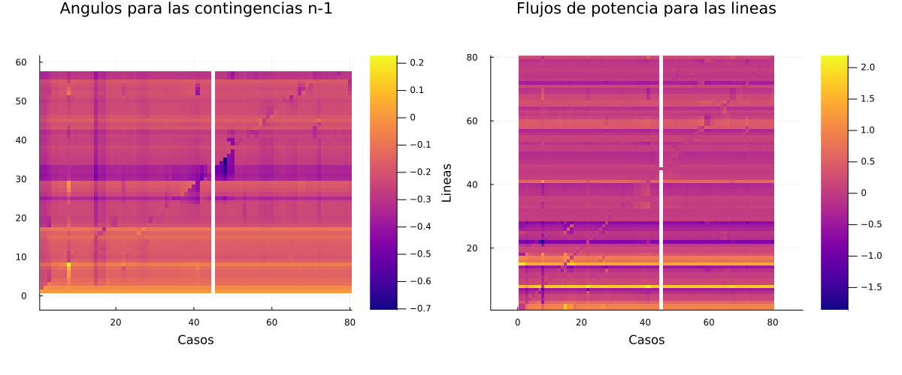
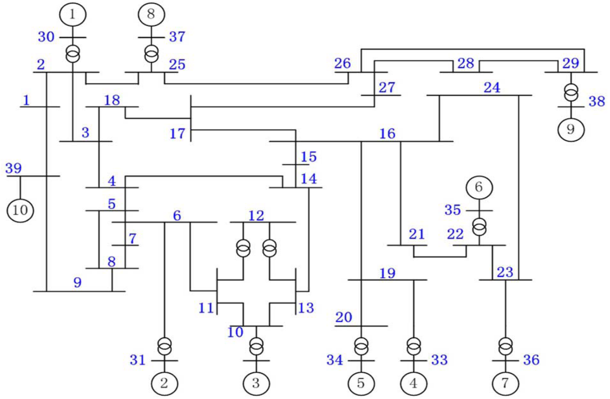

# Actividad_1_Metodos_Computacionales
Flujo de potencia DC y Análisis de Contingencias N-1

**REPRESENTACIÓN MATRICIAL DE LA RED**
*Flujo de carga DC y análisis de contingencias*

En este proyecto desarrollamos el *Flujo de carga DC* para un sistema electrico de 57 nodos conociendo así su funcionamiento en condiciones normales, posteriormente a esto realizamos el *Analisis de contingencias N-1* con lo cual se podrá identicar el impacto que posee la pérdida de una línea en el sistema.

Para esto se implementó la siguiente estructura:

1. Cálculo de las Matrices $Y_{bus}$ y $B_{bus}$
    * Se realizó la función que por objetivo tenía calcular la matriz $Y_{bus}$ por medio de los parámetros de resistencia, reactancia y susceptancia de la línea. Esta función nos entregaba una matriz 57x57 con los parametros de las conexiones entre cada nodo del sistema.

    * Siguiendo la misma estructura utilizada para la construcción de la matriz $Y_{bus}$, se realizó la función para el calculo de la matriz $B_{bus}$, esta solo tenia en cuenta la reactancia inductiva de la línea, omitiendo la parte resistiva y la susceptancia shunt, además sin tener en cuenta el nodo *Slack* garantizando con esto la invertibilidad.

2. Cálculo del flujo DC.

    * Se creó una función para calcular los angulos nodales utilizando como base la expresión $\theta_N = B_{bus}^{-1}*P_N$, el resultado obtenido corresponde a un vector con el valor de la abertura angula en cada nodo, además se incluyó en este que $\theta_{Slack} = 0$

    * Una vez obtenidos las aberturas angulares en cada nodo, se realiza el cálculo de la potencia por cada una de las líneas del sistema, para esto se utilizó la expresión $P_{km} = \frac{\theta_k-\theta_m}{X_{km}}$

3. Análisis de contigencias *N-1*.

    * Se creó una función para realizar el analisis de contigencias *N-1* en el sistema, para esto se realizó el calculo del flujo DC de forma iterativa considerando la pérdida de una línea a la vez, con lo cual se obtuvieron 80 casos de Flujos DC diferentes (uno por cada línea)

4. Análisis gráfico de los resultados.

    * Por medio de un mapa de calor se registraron cada uno de los casos obtenidos en la función para el análisis de contingencias N-1, en este gráfico se puede observar que líneas y nodos se ven mayormente afectados por la ausencia de un tramo de red, lo cual permite conocer en que puntos de la red se podria desarrollar una inversión para mejorar la confiabilidad del sistema.

    *Mapa de calor obtenido*
    

    *Diagrama Unifilar del sistema de Potencia*
    

**Marco teórico**

El cálculo del flujo de potencia es una herramienta esencial para determinar el comportamiento operativo de una red eléctrica, este marco teórico presenta la base matemática y computacional para el cálculo del flujo de potencia DC mediante la matriz de admitancia nodal.

1. Matriz de admitancia Nodal ($Y_{bus}$)
    Es una representación matricial de un sistema de potencia que describe las relaciones entre corrientes y tensiones en los nodos de la red. se define mediante la ecuación fundamental:
    **$I = Y_{bus}*V$**
    La construcción de esta matriz depende de los parámetros de las líneas de transmisión, como la resistencia ($R$), la reactancia($X$) y la susceptancia ($B$).

2. Matriz $B_{bus}$
    Para el análisis de flujo de potencia en DC, se utiliza una aproximación simplificada en la cual:
    * Se desprecia la resistencia de las líneas de transmisión.
    * Se asume que los ángulos de voltaje son pequeños.
    * Solo se considera la parte imaginaria de $Y_{bus}$, lo que da lugar a la matriz $B_{bus}$.

    La ecuación fundamental para el analisis de flujo de Potencia  en DC es:

    $P_N = B_{bus}*\theta$

3. Cálculo del Flujo de Potencia DC:
    El flujo de potencia en DC se obtiene resolviendo el sistema de ecuaciones:
    $\theta = B_{bus}^{-1}*P_N$

    Para ello, se elimina el nodo slack (referencia) de la matriz $B_{bus}$ para obtener un sistema cuadrado invertible.

**Funciones**

* **Librerias necesarias**
    - using LinearAlgebra
    - using DataFrames
    - using CSV
    - using Plots
*  **calcular_ybus()**
    *Requiere*
    - Entradas:   
        - lines: DataFrame con la información de los parámetros de las líneas
        - nodes : DataFrame con la información de las magnitudes en los nodos.
    - Salidas :    
        - Ybus : Matriz que describe la relación tensión corriente en el sistema.
* **calcular_bbus()**
*Requiere*
    - Entradas:   
        - lines: DataFrame con la información de los parámetros de las líneas
        - nodes : DataFrame con la información de las magnitudes en los nodos.
    - Salidas :    
        - Bbus : Matriz que se compone de la susceptancia de cada línea del sistema y sus conexiones con los nodos.

* **flujo_dc()**
*Requiere*
    - Entradas:   
        - lines: DataFrame con la información de los parámetros de las líneas
        - nodes : DataFrame con la información de las magnitudes en los nodos.
    - Salidas :    
        - df_theta : DataFrame de los angulos nodales
        - df_pkm : DataFrame del flujo de potencia por las líneas

* **contingencias()**
*Requiere*
    - Entradas:   
        - lines: DataFrame con la información de los parámetros de las líneas
        - nodes : DataFrame con la información de las magnitudes en los nodos.
    - Salidas :    
        - theta_cont : DataFrame de los angulos nodales para cada caso evaluado.
        - pkm_cont : DataFrame del flujo de potencia por las líneas para cada caso evaluado.
    
**Licencia**

Programa realizado por: Jean Pool Marín
jeanpool.marin@utp.edu.co

[![License : CC BY-NC-SA 4.0] (https: img.shields.io/badge/License-CC_BY--NC--SA--4.0-lightgrey)]
